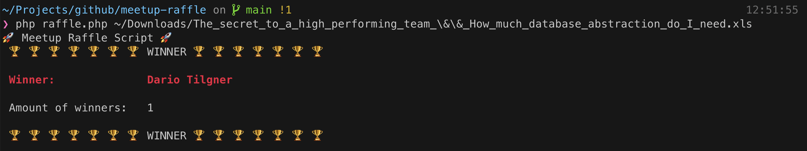

# Meetup.com Raffle

This is a simple script to randomly select a winner from a Meetup.com event's RSVP list.

## Usage
1. Download the attendees CSV file
2. Run `composer install`
3. Run `php raffle.php <path-to-csv-file>`

You can add Users to the local ignoreusers file (e.g. organizers). For each run the winner will be appended to the winners file.
All winners will be ignored for the next run.

